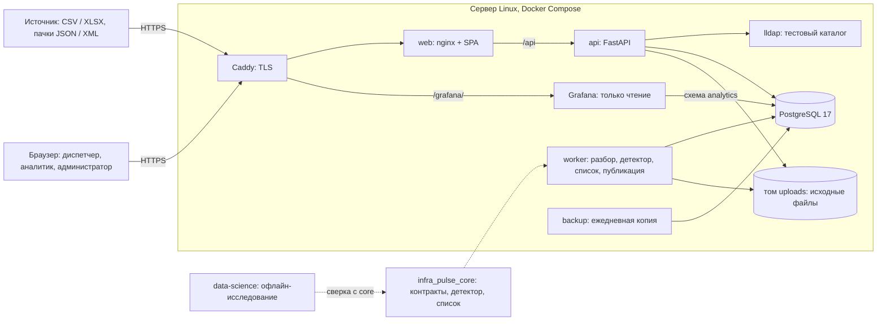

# InfraPulse MSK

InfraPulse MSK — прототип рабочего места диспетчера инженерных коллекторов с
ежедневным прогнозом обесточивания электрооборудования объектов (ЛЦТ 2026, кейс ДЖКХ,
задача №8). Работающий стенд — https://infra-pulse.ru (учётные записи передаются в форме
сдачи). Проверка за 10 минут —
[раздел ниже](#как-проверить-за-10-минут). Презентация и
документация (PDF, DOCX) — [папка на Яндекс Диске](https://disk.yandex.ru/d/Ws5JRA4PUH_kMw)
(в репозитории — [навигатор по docs/](docs/README.md)).

Прототип поддержки диспетчера инженерных коллекторов Москвы: ежедневный прогноз
обесточивания электрооборудования объекта на 14 суток, карточка с основанием и решением
диспетчера, схема объекта по пикетам, журнал «прогноз против факта», загрузка данных и
журнал действий пользователей. Кейс ДЖКХ, задача №8 (АО «Москоллектор»), ЛЦТ 2026.

`Неисправен` — технический признак потери связи (technical_fault_state_proxy), а не
подтверждённая физическая поломка. Признак `alarm` источника не считается подтверждённым
отказом.

## Состояние на 29.09.2026 — временная сводка

- **Стенд:** https://infra-pulse.ru, версия от 29.09.2026 — HTTPS (Caddy,
  сертификат Let's Encrypt), вход через тестовый каталог LDAP с ролями диспетчер, аналитик
  и администратор, журнал действий, Grafana `/grafana/`, ежедневные резервные копии. Засеяна
  история каналов «Состояние фазы»: 3,36 млн записей, 1 727 карточек, последняя выдача —
  30.06.2026 00:00 МСК. За июнь 2026 загружены также сообщения датчиков дыма, тепловых,
  газовых, затопления и насосов — 140 996 записей для колокольчика и блока «Сейчас». Учётные данные в репозитории не публикуются.
- **Прогноз:** статичный список v9 «Обесточивание электрооборудования объекта» по 19 объектам
  ДУ — горизонт 14 суток, до 10 карточек, срез выдачи 00:00 МСК. На отложенном периоде
  07.2025–06.2026 точность 0,773 и полнота по инцидентам 0,646 не ниже целевых показателей
  проекта 0,7 и 0,5 по заранее записанному критерию. ТЗ §9 оставляет эти показатели на этап
  проектирования; 0,7 и 0,5 организаторы назвали плановыми по умолчанию. По точности список
  равен правилу «объекты с событием за 14 суток»; главный аргумент — одинаковый прирост над
  случайным списком во всех трёх годах ([метрики и оговорки](#прогноз-и-итоговые-метрики)).
- **Исследование:** версии v1–v11. ML-модели на этих данных статичный список не превзошли,
  поэтому в продукте — статистический список
  ([журнал решений](data-science/experiments/sensor-failure/DECISION_LOG.md)). Локальные
  исследования 28–29.09: нейросети на последовательностях (GRU, LSTM, TCN, Transformer
  Encoder) список не превзошли, модели новых эпизодов по типам датчиков ТЗ не выполнили
  согласованный критерий преимущества над частотой. Это диагностика на уже просмотренных
  периодах, продукт не меняется
  ([последовательности](data-science/reports/phase-sequence-2026-09-28.md),
  [эпизоды](data-science/reports/registered-episodes-2026-09-29.md)).
- **Ответы заказчика 28.09** (на стенде с 29.09) учтены в
  словах интерфейса и документах: «тревожное сообщение
  СМВУ», событие прогноза — инцидент, а не авария, серии «похоже на ППР или ТО», пикет обычно
  через 10 м; подпись колокольчика называет, какие группы аварий в него пока не входят;
  рекомендация карточки v5: основной текст один для всех карточек, под ним сервер добавляет
  до трёх уточнений — частая повторная карточка, прошлая сбылась (5-я и дальше за 30 сут), и
  не больше двух групп линий карточки (насосы, вентиляция, теплосеть, ОЗК, освещение,
  межсекционный автомат); регламент не подтверждён. Охрана и температура в колокольчике — следующий шаг
  ([STATUS](docs/STATUS.md), [реестр решений](docs/REQUIREMENTS_DECISIONS.md)).
- **Нагрузка на стенде 28.09, 23:28 МСК:** 20 пользователей, 330 с, только чтение — 2 939
  запросов, 0 ошибок, p95 267 мс. Опрос «Сейчас» (`/attention`), решения и приём потока в
  этот профиль не входили. Восстановление стенда из ночной копии выполнено 29.09 за 6 мин
  (цель — 4 ч). Что ещё не проверено на стенде (копия вне сервера, пачка API) — в
  [STATUS](docs/STATUS.md).

[Точный статус](docs/STATUS.md) · [итог v9](data-science/experiments/sensor-failure/FINAL_V9.md) ·
[архитектура](docs/ARCHITECTURE.md) · [нормативные требования и evidence](docs/REQUIREMENTS_SPEC.md).

## Как проверить за 10 минут

1. **Стенд** — https://infra-pulse.ru. Учётные записи (диспетчер, аналитик) передаются в форме
   сдачи, в репозитории их нет. Данные стенда — журнал СМВУ организаторов 2019–06.2026,
   каналы «Состояние фазы»; последняя выдача прогноза — 30.06.2026 00:00 МСК.
2. **Сценарий диспетчера:** «Прогноз» (до 10 объектов на 14 суток) → карточка объекта (срок,
   оценка вероятности, факторы, линии «где искать», рекомендация) → решение с причиной и
   способом проверки → «Схема» (линии по пикетам, тревожные сообщения СМВУ за сутки) →
   «Журнал» («прогноз против факта»: сбылась / истекла, запас до события, решение).
3. **Аналитик** дополнительно видит «Исследование» (все проверенные области прогноза с
   точностью и полнотой) и «Графики сигналов» (Grafana). Коротко по ролям —
   [руководство пользователя](docs/USER_GUIDE.md).
4. **Что видно на стенде и почему.**
   - **Колокольчик** показывает сутки до 30.06.2026 23:53 МСК: 17 строк, все в группе
     «Пожар». Газа и затопления в эти сутки в данных нет. Объекты пожарной сигнализации не
     имеют линий фазы, поэтому у их строк пометка «схемы нет». Правила отбора —
     `critical-alarms-v1` ([ограничения](docs/ARCHITECTURE.md#ограничения)).
   - **Пожар и подтопление (ТЗ §12) прогнозируются только в «Исследовании».** Пожарный слой
     там — P 0,58, R 0,40, целевых показателей не достигает. Для подтопления у датчиков
     затопления нет событий, метеоданных нет. В продукте — один прогноз, обесточивание.
   - **Один поток данных на весь стенд.** Прогноз, журнал и время данных общие для всех
     пользователей. Запись с датой позже 30.06.2026 23:53 МСК сдвигает время прогноза у
     всех, и откатить это можно только восстановлением копии. Поэтому загрузка доступна
     только администратору: учётные записи диспетчера и аналитика загружать данные не
     могут. Проверка на других данных выполняется по запросу к команде: порядок времени
     записей, справочники и копия до загрузки ([подключение данных](docs/INTEGRATION_API.md)).
   - **Решения, принятые на стенде,** записываются текущим временем и видны в журнале, хотя
     данные заканчиваются 30.06.2026.
   - **ТЗ §10 «Интерактивная карта» → раздел «Схема»:** обзор всех объектов с выделением
     проблемных + мнемосхема объекта по пикетам; география — после получения GeoJSON/WKT.
5. **Без стенда** — локально на демонстрационных данных (раздел «Запуск») или на своём
   сервере по [runbook стенда](deploy/README.md): подготовка сервера, `.env`, деплой,
   засев истории, учётные записи, Grafana, копии.
6. **Сквозная проверка загрузки и API на своём компьютере** —
   [за 5 минут после сборки образов](docs/INTEGRATION_API.md#сквозная-проверка-за-5-минут):
   `INFRA_MODE=received docker compose up --build`, синтетические справочники и журнал из
   `docs/examples/`, токен интеграции, пачки JSON и XML до `published`, результат в
   «Загрузке», «Журнале» и «Схеме». Столбцы справочников и журнала —
   [форматы файлов](docs/INTEGRATION_API.md#форматы-файлов).
7. **Почему статистика, а не ML** — [перечень проверенных моделей и признаков](data-science/experiments/sensor-failure/FEATURES_TRIED.md)
   и [журнал решений](data-science/experiments/sensor-failure/DECISION_LOG.md): CatBoost, LightGBM,
   XGBoost, ранжирование, MLP, Хоукс, байесовская модель и вероятностный слой на отложенном
   периоде статичный список не превзошли; нейросети на последовательностях (GRU, LSTM, TCN,
   Transformer, 28–29.09) — тоже, разница в пределах шума. Числа — в
   `data-science/reports/*.json` (агрегаты без идентификаторов).
8. **Воспроизвести исследование.** Данные организаторов в репозиторий не входят. Выгрузку
   положить в `data-science/data/raw/` ([DATA](docs/DATA.md)), затем
   [итоговая модель v9: постановка, валидация и команды](data-science/README.md#итоговая-модель-в-продукте-v9)
   и раздел «Воспроизведение» [итога v9](data-science/experiments/sensor-failure/FINAL_V9.md);
   MLflow — `make mlflow` ([инструкция](data-science/mlflow/README.md)).
9. **Какие данные улучшат прогноз** (в журнале СМВУ знания о дне события нет): результаты
   проверок по карточкам (их собирает форма решения), плановые отключения и переключения
   энергосети, допуски на работы, журнал выполненных работ и ремонтов, исходы по
   «Неисправен» из журналов ОДС, данные после 06.2026 для новой независимой проверки.
10. **API** — документация https://infra-pulse.ru/api/docs (Swagger UI открыт без входа, запросы требуют сессию или токен; [как подключиться](docs/INTEGRATION_API.md#документация-api-swagger-ui)).

## Что умеет система

| Роль | Разделы интерфейса | Что доступно |
| --- | --- | --- |
| Диспетчер | Прогноз, Схема, Журнал | Список карточек с основанием, рекомендацией и оценкой вероятности уровня; решение и результат проверки; схема объекта по пикетам; колокольчик: сообщения СМВУ, которые по тексту могут означать аварию по классификации заказчика, — пожар, газ, затопление (охранные сработки и аномальная температура пока не входят; каждое сообщение проверяют диспетчер и дежурный инженер, это не подтверждённая авария); новые карточки — меткой «новая» |
| Аналитик | Прогноз, Схема, Журнал, Исследование; графики сигналов в Grafana | Области прогноза, точность и полнота с интервалами, «прогноз против факта»; отчёты JSON/XLSX через API; решений не принимает |
| Администратор | Все разделы и Загрузка | Всё, что диспетчер и аналитик; загрузка журнала и справочников CSV/XLSX (выгрузка организаторов и формат Приложения 1 ТЗ) с карантином и дедупликацией; выдача токенов интеграции на сервере |

Внешняя система передаёт новые записи пачками JSON или XML в `POST /api/v1/observations`
с токеном интеграции ([подключение данных](docs/INTEGRATION_API.md)). К системам заказчика
сервис не обращается: интеграция только входящая, черновик заявки хранится со статусом
«не отправлен». Запросы вошедших пользователей и интеграции к API пишутся в журнал действий;
Grafana ведёт собственный журнал. Какие персональные данные хранятся и кто к ним имеет
доступ (149-ФЗ, 152-ФЗ) — [ARCHITECTURE](docs/ARCHITECTURE.md#персональные-данные-и-защита-информации-149-фз-152-фз).

## Прогноз и итоговые метрики

**Что прогнозируется.** Для каждого из 19 объектов ДУ с каналами «Состояние фазы» —
зарегистрированное событие: потеря связи (`Неисправен`) линии электропитания объекта. Это и
есть метка прогноза; заголовок карточки «Обесточивание электрооборудования объекта» передаёт
её смысл для диспетчера. Потеря связи регистрируется только на линиях (освещение, вентиляция,
насосы), но в 8 из 10 событий линия затем «Обесточен», а в 56% событий 2023–2024 (период
разработки; при сдвиге на 1–7 сут — 0,2–0,6%) в те же минуты «Обесточен» приходит и по щиту
(ЩАП/АВР) объекта; в большинстве событий питание возвращается за минуты. Совпадение во времени
не устанавливает, что щит питает эти линии. Прогнозируемая запись «Неисправен» — тревожное
сообщение СМВУ: диспетчер и дежурный инженер проверяют его и относят к инциденту,
профилактическим работам или ошибке. По классификации заказчика (ответ 28.09) потеря связи и
электроснабжения — инцидент, а авария — угроза жизни людей (пожар, затопление, газ,
проникновение нарушителя, аномальная температура). Событие прогноза — инцидент, а не авария;
отказ не подтверждён, причину по журналу установить нельзя.

**Типы инцидентов (ТЗ §6) — частично.** В продукте прогнозируется один тип — обесточивание
объекта по потере связи линий электропитания. Остальные типы датчиков исследованы и целевых
показателей не достигают (таблица в разделе «Исследование»). Колокольчик относит текущие
сообщения СМВУ к группам аварий заказчика по тексту, но это не прогноз.

**Метод.** Оценка объекта — число его событий за 365 суток до среза. Каждые сутки в 00:00 МСК
список пополняется карточками по убыванию оценки до 10 открытых; карточка открыта 14 суток и
снимается в момент события. Объект без событий за год карточку не получает. «Оценка
вероятности для карточек этого уровня: ≈ N% (сбылось k из n)» — доля сбывшихся карточек того
же уровня на периоде разработки 2023–2024 (округление до 5 п. п.). Уровней три — ≈55, ≈75 и
≈85% — по числу событий объекта за 365 суток. На отложенном периоде проверены две группы, а не
три уровня: ≈55–75% — ожидали 0,68, сбылось 0,65 (144 из 220); ≈85% — ожидали 0,84, сбылось
0,87 (230 из 264); ошибка калибровки 0,028. Уровень ≈55% отдельно не проверялся; между 2023 и
2024 годами расхождение до 8 п. п.
Реализация — `packages/core/src/infra_pulse_core/features/incident_list.py`; тот же код
выполняет worker стенда, совпадение с исследованием подтверждено
[сверкой](data-science/reports/core-research-parity-v9-2026-09-27.json).

**Откуда 0,7 и 0,5.** ТЗ §9: «Целевые показатели точности (Precision) и полноты (Recall)
определяются на этапе проектирования исходя из качества предоставляемых данных» — чисел в ТЗ
нет. Значения 0,7 и 0,5 организаторы назвали плановыми (по умолчанию), а не жёсткими
требованиями ([обоснование целевых показателей](data-science/experiments/sensor-failure/CARD_AND_RECOMMENDATION.md#11-обоснование-целевых-показателей-по-тз-9)).
Команда приняла их целевыми показателями проекта.

**Результат на отложенном периоде 07.2025–06.2026** (14 суток, 10 карточек):

| Показатель | Список v9 [95% ДИ по неделям] | Правило «событие за 14 суток» (persistence) | Случайный список той же политики | Целевой показатель проекта |
| --- | --- | --- | --- | --- |
| Точность P | 0,773 [0,728; 0,815] | 0,76 | 0,54 [0,51; 0,57] | ≥ 0,7 |
| Полнота по инцидентам R | 0,646 [0,604; 0,689] | 0,55 | 0,39 [0,35; 0,43] | ≥ 0,5 |
| Полнота по новым инцидентам (76 инцидентов) | 0,72 | 0,11 | 0,62 [0,51; 0,72] | — |

Persistence и случайный список посчитаны справочно, после заморозки; у случайного списка —
медиана и интервал 2,5–97,5% по 1 000 выдачам.

**Главный аргумент — одинаковый прирост над случайным списком во всех годах** (10 карточек;
прирост — по неокруглённым значениям). Ни одна из 1 000 случайных выдач не достигла списка
ни в одном периоде.

| Период | P: список / случайный | Прирост P | R по инцидентам: список / случайный | Прирост R |
| --- | --- | ---: | --- | ---: |
| 2023, разработка | 0,66 / 0,44 | +0,21 | 0,69 / 0,41 | +0,28 |
| 2024, разработка | 0,76 / 0,52 | +0,24 | 0,68 / 0,39 | +0,30 |
| 07.2025–06.2026, отложенный | 0,77 / 0,54 | +0,23 | 0,65 / 0,39 | +0,26 |

**Честно о persistence.** По точности список равен правилу «объекты с событием за 14 суток»:
0,77 против 0,76 на отложенном периоде, 0,66–0,76 против 0,68–0,75 на разработке. Добавка
списка — инциденты после затишья: новые инциденты он ловит в 72% случаев, persistence — в 11%,
полнота по всем инцидентам выше на 0,09 (0,646 против 0,554). Но случайный список ловит новые
инциденты с долей 0,62 [0,51; 0,72], так что преимущество над ним по новым инцидентам — на
границе интервала.
Это список наблюдения за самыми активными объектами, а не ML-прогноз отказа.

**Когда и почему принята полнота по инцидентам.** Решение принято 27.09 — после третьего и
четвёртого использования отложенного периода. На третьем, по
прежнему определению (каждое событие отдельно), целевые показатели не выполнялись: 14 суток —
P 0,78, R 0,40 ([E29](docs/REQUIREMENTS_SPEC.md)). Причина смены: выдача идёт раз в сутки, и
между событиями одной серии новый прогноз выдать нельзя, поэтому серия с паузами меньше 24 ч —
один инцидент ([EVALUATION](data-science/experiments/sensor-failure/EVALUATION.md#решение-27092026-основной-recall--по-инцидентам)).
Если считать каждое событие отдельно (`R_strict`), полнота на отложенном периоде — 0,567
[0,496; 0,630]: нижняя граница ниже 0,5.

**Оговорки.**
- Критерий записан до прогона v9: нижние границы 95% доверительного интервала (bootstrap по
  неделям) не ниже целевых показателей. Конфигурация заморожена до чтения отложенного периода.
- Отложенный период использован для метрик пять раз, шестой раз — только для проверки
  калибровки «k из n». Определения полноты по инцидентам и снятия карточки в момент события
  приняты после третьего и четвёртого использования. Справочные ориентиры и пересчёт
  независимого аудита сделаны после заморозки. Новых данных после 06.2026 нет; живая
  проверка — журнал «прогноз против факта» на новых данных.
- По блокам объектов нижняя граница P — 0,662, ниже 0,7. Оценка держится на 11 парах
  «объект × тип датчика»; 87% карточек — хронические места.
- Инцидент в метриках (единица полноты) — серия событий пары с паузами меньше 24 ч; он
  пойман, если в момент его начала карточка открыта. Это счётная единица, а не категория
  заказчика: у заказчика инцидент — отклонение оборудования от рабочего состояния, в том числе
  потеря связи и электроснабжения, авария — угроза жизни людей.
- Точность считается по событию в окне карточки, включая продолжение серии, начавшейся до
  выдачи (56 из 374 сбывшихся карточек); если и точность считать только по новым инцидентам —
  0,657 [0,612; 0,698]. Целевой показатель выполнен по заранее записанному критерию, без
  запаса.
- Точность идёт за частотой событий года: в 2023 году та же настройка дала P 0,655. Доля
  пар-суток с событием в окне 14 суток — 0,395 в 2023, 0,458 в 2024 и 0,479 на отложенном
  периоде; у случайного списка P растёт так же — 0,44 → 0,52 → 0,54.
- Медианный запас до пойманного события — 85 ч.
- Другие типы датчиков целевых показателей не достигают и показаны только в разделе
  «Исследование».

Подробно — [FINAL_V9](data-science/experiments/sensor-failure/FINAL_V9.md),
[отчёт](data-science/reports/sensor-failure-final-v9-2026-09-27.json).

## Архитектура

Сервис — модульный монолит на одном сервере Linux под Docker Compose. Caddy завершает TLS и
отдаёт SPA (React в nginx) и Grafana. SPA работает только через HTTP API на FastAPI. API
проверяет вход через LDAP-каталог и серверные сессии, права роли на каждом маршруте и пишет
журнал действий. Загрузку файла или пачки API только сохраняет: файл — в том `uploads`,
задание — в очередь PostgreSQL. Дальше работает отдельный процесс worker.

Worker разбирает файл, записывает наблюдения с карантином и дедупликацией и пересчитывает
прогноз кодом ядра `infra_pulse_core`: эпизоды и события фазы, срезы 00:00 МСК, список.
Публикация атомарна: карточки нового поколения появляются одной транзакцией. Отдельного
inference-сервиса и файла модели нет — «inference» здесь означает пересчёт списка в worker.
Исследование и обучение выполняются офлайн в `data-science/` и в образы не попадают.
Подробно — [ARCHITECTURE](docs/ARCHITECTURE.md): компоненты, поток данных, роли, хранение,
безопасность, копии, настраиваемые параметры и ограничения.



## Установка

Нужны Git, [uv](https://docs.astral.sh/uv/getting-started/installation/) 0.8.4 (Python 3.12
он ставит сам), Docker с Compose для контейнеров и Node 24 ([nodejs.org](https://nodejs.org/en/download))
для frontend вне контейнеров. Разработка — macOS/Linux, CI и стенд — Linux. Команды — из
корня репозитория.

```sh
curl -LsSf https://astral.sh/uv/0.8.4/install.sh | sh             # если uv нет; затем новый терминал
git clone https://github.com/aleksandryessin/infra-pulse.git && cd infra-pulse
uv python install 3.12
uv sync --locked                                                  # API и make api
uv sync --locked --group platform --group train --group research  # всё для make check и исследования
npm --prefix frontend ci                                          # frontend вне Docker
```

Только для контейнеров (`docker compose up`) хватит Git и Docker. Полное окружение — около
1,8 ГБ: `.venv` и кэш пакетов `.uv-cache` внутри клона (`uv.toml`); первая установка с
пустым кэшем — до 15–20 мин в зависимости от сети. Общий кэш для нескольких клонов —
`UV_CACHE_DIR=~/.cache/uv`. Повторный `uv sync` с меньшим набором групп удаляет лишние
пакеты — повторяйте нужные `--group`. PyTorch (группа `sequence`) по умолчанию не ставится.
`.env` для локального запуска не нужен (пример — [`.env.example`](.env.example)).
Группы зависимостей и обновление lock — [DEPENDENCIES](docs/DEPENDENCIES.md); порты,
режимы и признаки успешного старта — [OPERATIONS](docs/OPERATIONS.md#локальный-старт).

## Запуск

### Локально

Быстрый старт с демонстрационными (синтетическими) данными:

```sh
INFRA_MODE=fixture docker compose up --build        # web http://127.0.0.1:8080/forecast
```

Если порт занят (5432 часто занят локальной PostgreSQL), задать свободные:
`WEB_PORT=18080 API_PORT=18000 DB_PORT=15432 INFRA_MODE=fixture docker compose up --build`
([OPERATIONS](docs/OPERATIONS.md#docker-compose)).

Без контейнеров — два терминала:

```sh
INFRA_MODE=fixture make api                              # API 127.0.0.1:8000, Swagger /api/docs
VITE_DATA_MODE=fixture npm --prefix frontend run dev     # SPA http://127.0.0.1:5173/forecast
```

`INFRA_MODE=fixture` обязателен: по умолчанию (`compose.yaml`, `make api`, `.env.example`)
API стартует в режиме `scaffold`, и Прогноз, Схема и Журнал отвечают 503. В режиме `fixture`
API возвращает только вымышленные записи. Локально вход выключен
(`INFRA_AUTH_MODE=dev_stub`): все запросы идут от локального оператора со всеми ролями.

| Что | Команда из корня | Результат |
| --- | --- | --- |
| Контейнеры | `INFRA_MODE=fixture docker compose up --build` | web 8080, API 8000, worker, PostgreSQL 5432 — только на localhost |
| API | `INFRA_MODE=fixture make api` | API на 127.0.0.1:8000, Swagger `/api/docs`, схема `/api/openapi.json` |
| Frontend | `VITE_DATA_MODE=fixture npm --prefix frontend run dev` | SPA на 127.0.0.1:5173; режим сборки `VITE_DATA_MODE`: `fixture`, `replay`, `received` |
| Загрузка CSV и пачки API → прогноз | `INFRA_MODE=received docker compose up --build` | web 8080 → «Загрузка»; сначала справочник каналов ([форматы](docs/INTEGRATION_API.md#форматы-файлов), [примеры и порядок](docs/INTEGRATION_API.md#сквозная-проверка-за-5-минут)); в `fixture` файлы и пачки не сохраняются (`simulated`); без контейнеров — [инструкция backend](backend/README.md#загрузка-csv-и-ingestion-worker-b1) |
| Исследование | `make research`, `make mlflow`, `make mlflow-smoke` | Jupyter для `data-science/notebooks`; локальный MLflow на 127.0.0.1:5000 |

Swagger открывается по `/api/docs` — у API (8000) и через web (8080). Адрес `/docs` у web
8080 без Caddy отдаёт страницу SPA (код 200), а не Swagger; в публичном режиме его закрывает
Caddy (404).

### Стенд

Стенд собирается на сервере из переданного кода: ручной workflow GitHub Actions
`Deploy stand` или `deploy/remote-deploy.sh --public` на сервере. Секреты хранятся только
в серверном `.env` (шаблон — `deploy/.env.server.example`). Подготовка сервера, публичный
режим, учётные записи каталога, засев истории, токены интеграции, копии и Grafana — в
[runbook стенда](deploy/README.md).

## Проверки

```sh
make check            # Ruff + полный pytest (backend, core, data-science)
make check-db         # PostgreSQL: INFRA_TEST_RECEIVED_DSN и INFRA_TEST_REPLAY_DSN на одноразовую БД
make check-sequence   # необязательно: группа sequence (PyTorch), тесты последовательностей и эпизодов
make contracts        # Pydantic → contracts/openapi.json и fixtures
npm --prefix frontend run generate:api
npm --prefix frontend run build
npm --prefix frontend test
```

Прогон этого репозитория 29.09.2026 (macOS arm64): `make check` — 664 passed, 110 skipped
(пропуски — тесты PostgreSQL без DSN, их выполняет `make check-db`); `make check-db` на
PostgreSQL 17.11 — 117 passed; `npm test` — 60 passed; `make contracts` и `generate:api` —
без изменений ([подробно](docs/STATUS.md#проверки-этого-репозитория-29092026)). История Git
тестам не нужна: копия, скачанная архивом, проверяется так же.

CI (GitHub Actions, workflow `Checks`) проверяет Python с PostgreSQL, изоляцию API от
исследовательского кода, скрипты деплоя и frontend; развёртывание — отдельный ручной
workflow. [Что проверяется](docs/OPERATIONS.md#github-actions-что-проверяется).

## Структура репозитория

```text
frontend/        React + TypeScript + Vite, Ant Design; сборка в nginx
backend/         FastAPI (infra_pulse_backend): API, вход LDAP, роли, журнал действий,
                 worker загрузки и пересчёта прогноза, миграции PostgreSQL 0001–0021 и 9000, скрипты
packages/core/   infra_pulse_core: canonical contracts, детектор эпизодов фазы и список
                 прогноза — чистый Python, общий для worker и исследования
contracts/       сгенерированные OpenAPI и синтетические fixtures
deploy/          серверный Compose, Caddy (TLS), lldap, Grafana, резервные копии, runbook
data-science/    офлайн-исследование (infra_pulse_research): ETL, метки, версии v1–v11,
                 отчёты; данные, веса и прогоны вне Git
tools/, tests/   экспорт контракта; проверки границ между компонентами
docs/            архитектура, эксплуатация, интеграция, UI, требования, статус;
                 docs/examples — синтетические справочники, журнал и пачки для проверки загрузки
```

В корне — общие `pyproject.toml` и `uv.lock` (один uv workspace), `Makefile`, `compose.yaml`
и правила внесения изменений. Сырые данные, Parquet, веса, базы MLflow и секреты в Git не входят;
публикуются код, замороженные конфигурации, команды воспроизведения и агрегированные отчёты.

## Документация

| Вопрос | Документ |
| --- | --- |
| Что реально работает и что проверено | [STATUS](docs/STATUS.md) |
| Как работать в интерфейсе: диспетчер, аналитик, администратор | [руководство пользователя](docs/USER_GUIDE.md) |
| Как устроена система | [ARCHITECTURE](docs/ARCHITECTURE.md) |
| Какие персональные данные хранятся, 149-ФЗ и 152-ФЗ | [ARCHITECTURE](docs/ARCHITECTURE.md#персональные-данные-и-защита-информации-149-фз-152-фз) |
| Как устроен интерфейс | [UI](docs/UI.md), [дизайн-система](docs/design/SYSTEM.md) |
| Как запускать и что измерено | [OPERATIONS](docs/OPERATIONS.md), [runbook стенда](deploy/README.md) |
| Как передать данные | [INTEGRATION_API](docs/INTEGRATION_API.md) |
| Данные и исследование | [DATA](docs/DATA.md), [исследовательский контур](data-science/README.md), [«Отказ датчика»: версии и отчёты](data-science/experiments/sensor-failure/README.md) |
| Требования, evidence и открытые решения | [REQUIREMENTS_SPEC](docs/REQUIREMENTS_SPEC.md), [REQUIREMENTS_DECISIONS](docs/REQUIREMENTS_DECISIONS.md) |
| Почему выбраны направление и итоговое решение | [выбор направления](docs/DIRECTION_DECISION_2026-09-26.md), [журнал решений](data-science/experiments/sensor-failure/DECISION_LOG.md) |
| Библиотеки и группы зависимостей | [DEPENDENCIES](docs/DEPENDENCIES.md), [компоненты и версии](docs/ARCHITECTURE.md#компоненты-и-библиотеки) |
| Навигация по всем документам | [docs/README](docs/README.md) |

## Ограничения

Основные ограничения текущей версии; полный список —
[ARCHITECTURE](docs/ARCHITECTURE.md#ограничения).

- Прогноз выдаётся только для «Состояния фазы» объектов ДУ; остальные типы датчиков — в
  «Исследовании». Пожар и подтопление (ТЗ §12) прогнозируются только там. На стенд загружены
  только каналы фазы, поэтому колокольчик там пуст.
- Горизонт 14 суток и 10 мест в списке — параметры версии политики в коде, а не настройка
  администратора ([параметры](docs/ARCHITECTURE.md#настраиваемые-параметры)).
- Оценка вероятности «k из n» — таблица по 2023–2024; уровень объекта скользящий;
  перекалибровка по журналу — следующий шаг ([процедура](docs/ARCHITECTURE.md#развитие)).
- Один поток данных на экземпляр: загрузка любого пользователя меняет прогноз и время данных
  для всех. Защиты от записей «из будущего» нет — откат только восстановлением копии.
- Поток принимается только по REST (пачки JSON или XML); очереди сообщений (брокера) нет.
  Коннектора к системам заказчика нет: реестры (справочники каналов, объектов, состояний)
  обновляются только загрузкой файла администратором. GeoJSON/WKT нет; интерактивную карту
  (ТЗ §10) заменяет условная «Схема объектов»: обзор всех объектов и схема объекта по пикетам.
  Ответы API — JSON.
- Вход проверен с тестовым каталогом lldap. Раскладка каталога задана в коде: bind по DN
  `uid=<логин>,ou=people,<base DN>`, группы — прямо в `ou=groups,<base DN>`, имена групп
  равны ролям `dispatcher`, `analyst`, `admin`; настраиваются только адрес каталога, base DN
  и таймаут. Для Active Directory заказчика нужны шаблон bind (UPN или `DOMAIN\user`),
  поиск по `sAMAccountName` и соответствие групп AD ролям — planned.
- PostgreSQL: ТЗ требует версию 12 и выше; продукт проверен на 14 и 17, прогона на 12 не было.
  `deploy/restore.sh` использует `DROP DATABASE … WITH (FORCE)` — синтаксис PostgreSQL 13+;
  скрипт рассчитан на поставляемый PostgreSQL 17.
- Нет территориальных ролей; журнал действий просматривается только запросом к БД.
- API и worker подключаются к PostgreSQL рантайм-ролью только с DML: журнал действий и
  решения она лишь дописывает. Действует на стенде с 29.09
  ([роли PostgreSQL](deploy/README.md#роли-postgresql)). Владелец схемы —
  суперпользователь образа postgres; он работает только в миграциях, копиях и разовых
  загрузках. Отдельных ролей для API и worker нет.
- Резервная копия хранится на том же сервере и не шифруется. Восстановление на объёме стенда
  проверено 29.09: 6 мин, строки 36 таблиц совпали с копией.

## Лицензии компонентов

Лицензия проекта — MIT ([LICENSE](LICENSE)).

Сторонние компоненты используются без изменений: библиотеки — как зависимости из PyPI и npm,
сервисы — как отдельные официальные контейнеры. Компоненты с копилефт-лицензиями:
psycopg 3 и ldap3 — LGPL-3.0, lldap — GPL-3.0, Grafana — AGPL-3.0. Остальные — MIT, BSD,
Apache-2.0, PSF и PostgreSQL License. Таблица «компонент — версия — лицензия — где используется» —
[ARCHITECTURE](docs/ARCHITECTURE.md#компоненты-и-библиотеки).

## Внесение изменений

Автор изменения обновляет связанные инструкции, статус и результаты проверок в том же
diff: [CONTRIBUTING](CONTRIBUTING.md).
