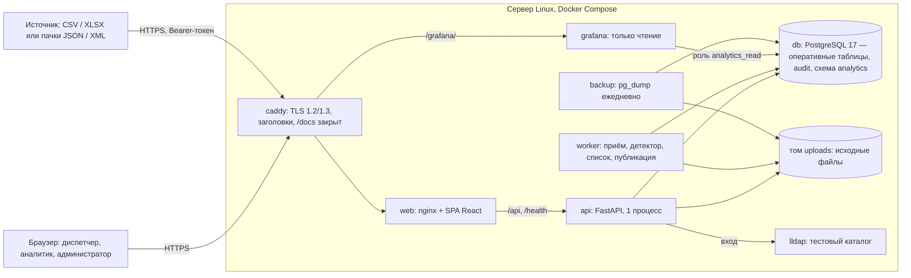
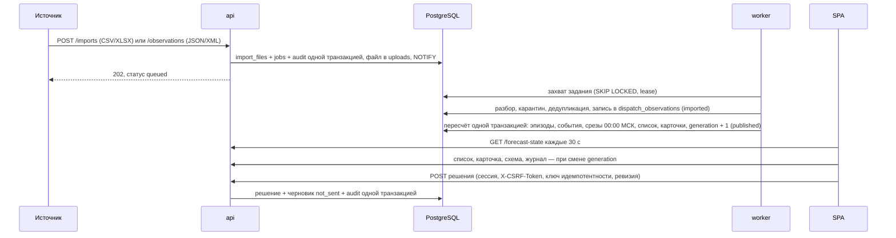

# Архитектура InfraPulse MSK

Как система построена на 29.09.2026. Описание сверено с `compose.yaml`,
`deploy/compose.server.yaml`, `deploy/compose.public.yaml`, кодом `backend/` и
`packages/core/` и миграциями `backend/migrations/0001`–`0021` и `9000`. Что проверено на стенде
и локально — [STATUS](STATUS.md); эксплуатация стенда — [runbook](../deploy/README.md);
приём данных — [INTEGRATION_API](INTEGRATION_API.md). Нормы и evidence —
[REQUIREMENTS_SPEC](REQUIREMENTS_SPEC.md), открытые решения —
[REQUIREMENTS_DECISIONS](REQUIREMENTS_DECISIONS.md).

## Основные решения

1. **Модульный монолит.** Один backend-пакет `infra_pulse_backend` с отдельными процессами
   `api` (HTTP) и `worker` (загрузка и пересчёт). Один сервер Linux, Docker Compose.
2. **PostgreSQL — единственное хранилище продукта**, в том числе очередь заданий
   (`FOR UPDATE SKIP LOCKED`, lease, `LISTEN/NOTIFY`). Брокер сообщений не нужен: внешний
   приём — REST, внутренний поток — одна очередь со строгим порядком.
3. **«Inference» — пересчёт списка в worker.** Прогноз — статичный список v9 из общего
   кода `infra_pulse_core`. ML-модели на этих данных список не превзошли
   ([журнал решений](../data-science/experiments/sensor-failure/DECISION_LOG.md)), поэтому
   файла модели, отдельного inference-сервиса и MLflow в продукте нет.
4. **Один контракт.** Pydantic-схемы в `packages/core/src/infra_pulse_core/contracts/`;
   `contracts/openapi.json` и TS-типы frontend генерируются из них.
5. **Интеграция только входящая.** Сервис принимает файлы и пачки, но сам к системам
   заказчика не обращается; черновик заявки хранится со статусом `not_sent`.
6. **Исследование офлайн.** `data-science/` не входит в образы; совпадение core с
   research-реализацией v9 проверено
   ([сверка](../data-science/reports/core-research-parity-v9-2026-09-27.json)).

## Компонентная архитектура

| Сервис | Образ | Назначение | Доступ из сети | CPU / RAM на стенде |
| --- | --- | --- | --- | --- |
| `caddy` | `caddy:2.11.4-alpine` (digest) | TLS Let's Encrypt, заголовки безопасности, прокси на `web` и `/grafana/`; корневые `/docs`, `/redoc`, `/openapi.json` снаружи — 404, документация API — `/api/docs` | 80, 443 — единственные открытые порты | 0,5 / 256 MiB |
| `web` | `nginx:1.28-alpine`, сборка `node:24-alpine` | Статика SPA; прокси `/api` и `/health` на `api` | только сеть Compose | 0,5 / 256 MiB |
| `api` | `python:3.12-slim`, stage `api` | FastAPI, один процесс uvicorn: вход, права, чтение, решения, приём загрузок, журнал действий | только сеть Compose | 1,5 / 1 GiB |
| `worker` | stage `worker` | Очередь заданий, разбор, запись, пересчёт и публикация; работает рантайм-ролью `infra_pulse_app` (миграции применяет `migrate`); один экземпляр | нет | 1 / 1,5 GiB |
| `db` | `postgres:17-alpine` | Все данные продукта | не опубликован | 2 / 3 GiB |
| `lldap` | `lldap/lldap:v0.6.3-alpine` (digest) | Тестовый LDAP-каталог: учётные записи и группы ролей | только сеть Compose | 0,5 / 256 MiB |
| `grafana`, профиль `analytics` | `grafana/grafana:12.4.11` (digest) | Графики сигналов; вход через lldap; читает только схему `analytics` | через Caddy `/grafana/` | 0,5 / 512 MiB |
| `backup`, профиль `backup` | `postgres:17-alpine` | Ежедневная копия БД, тома `uploads` и конфигурации | нет | 0,5 / 512 MiB |
| `migrate`, `replay-loader`, профиль `tools` | stage `ops` | Разовые: миграции; загрузка replay-среза | нет | на время запуска |
| `received-watcher`, профиль `received` | stage `ops` | Устаревший приём JSON из папки; заменён `worker` и потоковым API | нет | 0,5 / 512 MiB |

Сервер стенда — 6 vCPU / 11 GiB; бюджет ресурсов — в
[runbook](../deploy/README.md#бюджет-ресурсов-6-vcpu--11-gib). Корневой `compose.yaml` — тот
же состав без Caddy и lldap, порты только на `127.0.0.1`, вход выключен (`dev_stub`).

## Функциональная архитектура

| Функция | Что делает | Где в коде | Право |
| --- | --- | --- | --- |
| Вход и сессии | Bind к LDAP-каталогу, роли из групп, серверная сессия, cookie и anti-CSRF | `api/auth.py`, `auth/ldap.py`, `auth/sessions.py` | — |
| Загрузка файлов | `POST /api/v1/imports`: журнал и три справочника, CSV или XLSX, формат выгрузки организаторов и Приложения 1 ТЗ | `api/imports.py`, `ingestion/` | `import` |
| Поток данных | `POST /api/v1/observations`: пачки JSON или XML (одна схема `ObservationBatch`, XML без DTD и сущностей) с токеном интеграции | `api/observations.py`, `ingestion/batch_xml.py`, `auth/tokens.py` | `ingest` |
| Разбор и запись | Карантин с номером строки, дедупликация, версии справочников | `worker/runner.py`, `ingestion/` | — |
| Пересчёт прогноза | Детектор эпизодов фазы, срезы 00:00 МСК, список, публикация поколения | `operations/forecast_publish.py`; core `features/phase_feeder_episodes.py`, `features/incident_list.py` | — |
| Прогноз и карточка | Список, карточка, состояние публикации, реестр хронических мест | `api/forecasts.py`, `api/forecast_db.py` | `read` |
| Решение и результат проверки | Ревизии решения, черновик заявки `not_sent`, результат проверки | `api/decisions.py`, `storage/decisions_pg.py`, `storage/check_results_pg.py` | `decide` |
| Журнал «прогноз против факта» | Выдачи, исходы, события окна; качество P/R | `api/forecasts.py` (`/forecast-journal`, `/forecast-journal/quality`) | `read`; качество — `research` |
| Схема объекта | Линии электропитания по пикетам, тревожные сообщения СМВУ за сутки | `api/forecasts.py` (`/schemes`) | `read` |
| Исходные сообщения | Записи источника по объекту и каналу | `api/app.py` (`/attention`), `storage/attention_pg.py` | `read` |
| Колокольчик | Новые карточки и сообщения, которые по тексту могут означать аварию (классификация заказчика) | `api/notifications*.py`, `operations/notifications.py` | `read` |
| Исследование | Сводка отчёта v9 из образа API | `api/research.py` | `research` |
| Отчёты | Месячная сводка JSON/XLSX, журнал прогнозов XLSX | `api/reports*.py`, `operations/reports.py` | `report` |
| Журнал действий | Доменные события в транзакции изменения; просмотры и опросы — middleware | `api/audit_log.py`, `storage/audit_pg.py` | пишется для всех |
| Токены интеграции | Выдача, список, отзыв; в БД только SHA-256 | `python -m infra_pulse_backend.admin token` | администратор сервера |
| Графики сигналов | Числовые значения и текстовые состояния во времени | `deploy/grafana/`, миграции 0016, 0020 | группы каталога analyst, admin |

Пути кода — внутри `backend/src/infra_pulse_backend/` и `packages/core/src/infra_pulse_core/`.

## Поток данных: от источника до карточки

1. **Приём.** API проверяет формат и размер (файл до 50 MB; пачка до 5 MiB и 5 000 записей),
   сохраняет файл в том `uploads`, считает SHA-256 и в одной транзакции создаёт запись
   загрузки, задание и событие журнала действий. Ответ — 202.
2. **Очередь.** Worker берёт задания строго по порядку загрузки: скользящий список зависит от
   порядка истории. Lease 300 с продлевается на каждом этапе; после сбоя процесса задание
   перехватывается, после исчерпания попыток — `failed/internal_error`.
3. **Разбор и запись.** Текст значения хранится дословно; число — отдельно, только для
   десятичной записи с точкой. Ключ дедупликации — канал, время, `ид_события`, значение;
   он общий для CSV, XLSX и API. Плохие записи уходят в карантин с номером, канал вне
   справочника сохраняется с неизвестным объектом.
4. **Пересчёт и публикация.** Детектор ядра читает новые записи «Состояния фазы», строит
   эпизоды и события объекта, затем для каждого среза 00:00 МСК не позже последних данных —
   оценку и шаг списка. Карточки, исходы и события окна записываются вместе с новым
   поколением одной транзакцией: частичной выдачи не бывает, снимки карточек неизменяемы.
5. **Показ.** SPA опрашивает `/forecast-state` и перечитывает данные при смене поколения.
6. **Решение.** Решение диспетчера, черновик заявки и событие журнала действий пишутся одной
   транзакцией; повтор с тем же ключом не создаёт дубль, устаревшая ревизия — 409.

Статусы загрузки: `queued → parsing → imported → recomputing → published`, либо
`duplicate` или `failed`. Справочник после записи сразу `published`.

## Модули и границы кода

| Компонент | Содержимое | Зависимости |
| --- | --- | --- |
| `backend/.../api` | HTTP-маршруты, middleware журнала действий, путь чтения из PostgreSQL | core contracts; FastAPI, psycopg, ldap3, openpyxl, defusedxml |
| `backend/.../auth` | LDAP, сессии, ограничение попыток входа, токены интеграции | — |
| `backend/.../ingestion` | Разбор CSV/XLSX/JSON/XML, справочники, запись в PostgreSQL | — |
| `backend/.../worker`, `operations` | Очередь, этапы задания, пересчёт и публикация, уведомления, отчёты | core `features` |
| `packages/core/.../contracts` | Canonical Pydantic-схемы API | Pydantic |
| `packages/core/.../features` | Детектор эпизодов фазы, список прогноза, имена каналов — чистый Python | без HTTP, БД и research |
| `data-science/` | ETL, метки, версии v1–v11, отчёты, MLflow | core `features`; DuckDB, PyArrow, scikit-learn, CatBoost, MLflow |
| `frontend/` | SPA; TS-типы из OpenAPI | только HTTP API |

Образ `api` ставит только базовые зависимости; образ `worker` добавляет `core[features]` и
группу `data`. Research, MLflow и обучение не входят ни в один образ. Границы проверяет
`tests/test_component_boundaries.py`: API в режиме fixture не импортирует research и
ML-библиотеки, направление зависимостей в исходниках соблюдено, сгенерированные OpenAPI и
fixtures совпадают с контрактом.

## Роли и права

Роли приходят из групп LDAP-каталога и складываются. Права проверяет сервер на каждом
маршруте (`packages/core/src/infra_pulse_core/contracts/auth.py`); интерфейс только скрывает
недоступные разделы.

| Право | Что открывает | Диспетчер | Аналитик | Администратор | Токен интеграции |
| --- | --- | --- | --- | --- | --- |
| `read` | Прогноз, Схема, Журнал, исходные сообщения, колокольчик | да | да | да | нет |
| `decide` | Решение и результат проверки | да | нет | да | нет |
| `research` | Исследование, качество P/R | нет | да | да | нет |
| `report` | Отчёты JSON/XLSX | нет | да | да | нет |
| `import` | Загрузка CSV/XLSX | нет | нет | да | нет |
| `ingest` | `POST /api/v1/observations` и статус своих пачек | нет | нет | да | да |

- **Вход** (`INFRA_AUTH_MODE=ldap` на стенде): bind к каталогу, серверная сессия на 480 мин.
  Браузер хранит два cookie `__Host-…` (`Secure`, `SameSite=Lax`): сессию (`HttpOnly`) и
  anti-CSRF-токен, который SPA повторяет в `X-CSRF-Token` на каждом POST. В БД — только
  SHA-256 токенов. Изменение групп в каталоге действует со следующего входа.
- **Ограничение попыток входа:** 5 неудачных за 300 с на имя пользователя.
- **Токен интеграции** даёт только `ingest`; передаётся в заголовке `Authorization`.
- **Grafana:** группа analyst — Viewer, admin — Admin; анонимного входа нет.
- **Локально** (`INFRA_AUTH_MODE=dev_stub`) вход выключен: все запросы идут от локального
  оператора со всеми ролями. Публичный стенд требует `ldap`.
- Территориальных ролей (район, ОДС) нет — [ограничения](#ограничения).

## Хранение

### Оперативный контур — PostgreSQL

PostgreSQL 17 на стенде (тесты — на PostgreSQL 14). Наблюдения и таблицы прогноза
привязаны к рабочему scope `(namespace_id, snapshot_id)`: новый stream — отдельная история.

| Группа | Таблицы | Особенности |
| --- | --- | --- |
| Наблюдения | `dispatch_observations`, `dispatch_replay_snapshots` | Значение дословно, число отдельно, `alarm` источника nullable («не передан»); одна таблица без секционирования и retention |
| Загрузки и справочники | `import_files`, `import_quarantine`, `observation_batches`, `jobs`, `ref_versions`, `ref_channels`, `ref_objects`, `ref_states` | SHA-256 файла и пачки; версия справочника действует для следующих загрузок |
| Прогноз | `forecast_scopes` (поколение), `forecast_detector_state`, `forecast_phase_*`, `forecast_coverage_days`, `forecast_object_days`, `forecast_runs`, `forecast_cutoffs`, `forecast_cards`, `forecast_card_outcomes`, `forecast_card_window_events`, `forecast_card_log`, `forecast_channel_layout`, `forecast_objects` | Снимки карточек неизменяемы (триггер) |
| Работа диспетчера | `forecast_decisions`, `forecast_check_results`, `work_order_drafts` | Решения и результаты только дописываются (права роли и триггер); черновик всегда `not_sent` |
| Доступ и журнал действий | `auth_sessions`, `integration_tokens`, `audit_events` | Только SHA-256 токенов; `audit_events` только дописывается (права роли и триггер) |
| Исходные сообщения replay/received | таблицы миграций 0001–0011 | Ограниченный срез и заметки проверки |

Миграции идемпотентны. Их применяет владелец схемы (`POSTGRES_USER`): разовый сервис
`migrate` перед каждым запуском api и worker, а также loader'ы и засев истории
([порядок и содержание](../backend/migrations/README.md)). Последняя миграция `9000` выдаёт
права рантайм-роли, [безопасность](#безопасность).

### Архив исходных файлов

Каждый принятый файл и каждая пачка (JSON или XML) хранятся как есть в томе `uploads`; SHA-256 и
отчёт загрузки — в `import_files`, SHA-256 тела пачки — в `observation_batches`. Точный
повтор уже принятого файла помечается `duplicate`, его копия удаляется. Том входит в
ежедневную копию. Ротации и переноса старых файлов нет. Исторический архив выгрузки в
Parquet и DuckDB существует только в исследовательском контуре `data-science/`, не на стенде.

### Аналитические витрины

Схема `analytics` состоит только из view над оперативными таблицами: сигналы в длинном
формате (`signals`, `signal_numeric`, `signal_state`, `source_alarms`) и справочники для
фильтров (миграции 0016, 0020). Роль `analytics_read` имеет доступ только к этой схеме; логин
Grafana создаёт `deploy/grafana/create-reader.sh`. API продукта схему не читает. Отчёты
JSON/XLSX API строит из оперативных таблиц по запросу.

## Безопасность

- **Периметр.** Открыты только 80 и 443 у Caddy. TLS 1.2 и 1.3, сертификат Let's Encrypt;
  CSP без `unsafe-inline` для скриптов, `X-Frame-Options: DENY`, `nosniff`,
  `Referrer-Policy: no-referrer`, HSTS (сейчас 300 с). PostgreSQL, API, lldap наружу не
  опубликованы.
- **Документация API.** При `INFRA_PUBLIC_DOCS=true` API отдаёт Swagger UI `/api/docs` и
  схему `/api/openapi.json`; открыта только документация, каждый маршрут по-прежнему
  проверяет сессию или токен интеграции (тест `test_rbac_matrix.py`: с включённой
  документацией анонимными стали только её GET-маршруты). Файлы Swagger UI отдаёт сам API
  из закреплённого пакета, запуск — внешним скриптом, поэтому страница работает под общей
  CSP сайта без исключения и без CDN. В схеме описаны `integrationToken` (Bearer),
  `sessionCookie` и `csrfToken`; `servers`, адресов и секретов в ней нет. Корневые `/docs`,
  `/redoc`, `/openapi.json` — 404. Токен, введённый в «Authorize», хранится только в
  памяти вкладки.
- **Контейнеры.** `no-new-privileges` у всех сервисов стенда; у Caddy, Grafana и backup —
  файловая система только для чтения и `cap_drop: ALL`. Образы Caddy, lldap и Grafana
  закреплены digest-ом; `api` и `worker` работают от непривилегированного пользователя.
- **Секреты** — только в серверном `.env` (права 600); в Git — шаблон
  `deploy/.env.server.example`. Токен интеграции печатается один раз.
- **Роли PostgreSQL.** api, worker и CLI токенов подключаются ролью `infra_pulse_app`:
  NOSUPERUSER, без CREATE на БД и схеме, только DML по явной матрице миграции
  `9000_runtime_role.sql` (новая таблица без строки в матрице роняет тест). У неё нет DDL,
  `TRUNCATE`, `COPY … PROGRAM`, чтения файлов сервера и `pg_authid`, `SET ROLE` на
  владельца, отключения триггеров. Журнал действий, решения, результаты проверки и
  черновики для неё только дописываются (INSERT и SELECT); триггеры остаются второй
  защитой. Текст наблюдения она не меняет: UPDATE только на `alarm`. Владелец схемы
  `POSTGRES_USER` работает только в `migrate`, `backup` и разовых загрузках. Пароль роли
  генерирует деплой, на сервер уходит SCRAM-verifier. Grafana читает только view
  `analytics` ролью `analytics_read`. Порядок и откат — [deploy](../deploy/README.md#роли-postgresql).
- **Журнал действий** (ТЗ §11). Вход, выход, решение, загрузка, пачка API и операции с
  токенами пишут событие в той же транзакции, что и изменение. Просмотры и выгрузки пишет
  middleware; фоновые опросы интерфейса сворачиваются в сводку за 15 мин. Тела запросов,
  cookie и токены не пишутся. Просмотр журнала — только запросом к БД.
- **Персональные данные** — [ниже](#персональные-данные-и-защита-информации-149-фз-152-фз).

### Персональные данные и защита информации (149-ФЗ, 152-ФЗ)

ТЗ §14 требует соответствия 149-ФЗ «Об информации, информационных технологиях и о защите
информации» и 152-ФЗ «О персональных данных». Здесь описано, что сервис хранит, где и кто
имеет доступ. Оценка соответствия, модель угроз и определение уровня защищённости
не проводились.

**Данные источника.** ТЗ §7: передаваемые данные проходят обфускацию (обезличивание) на
стороне источника. Журнал СМВУ и справочники описывают каналы, объекты и состояния
оборудования; персональных данных в них нет, и сервис их не добавляет.

**Что хранится.**

| Данные | Где | Зачем | Сколько хранится |
| --- | --- | --- | --- |
| Логин, отображаемое имя пользователя каталога (в AD — обычно ФИО), роли | `auth_sessions` | Сессия входа | Сессия — 480 мин; строка удаляется через 30 сут после истечения, при очередном входе |
| Логин, роль, IP-адрес клиента, идентификатор запроса, действие и его объект | `audit_events` | Журнал действий (ТЗ §11) | Бессрочно, только дописывается; срок не задан |
| Логин автора решения, результата проверки, черновика и загрузки | `forecast_decisions`, `forecast_check_results`, `work_order_drafts`, `import_files` | Авторство работы диспетчера | Бессрочно |
| Свободный текст: «Кому сообщено», «Уточнение основания», «Что устранено: другое», комментарий к результату, текст черновика | те же таблицы | Работа диспетчера | Бессрочно. В текст можно вписать ФИО или телефон; сервис это не проверяет |
| Учётные записи тестового каталога: логин, имя, хеш пароля (e-mail — заглушка `…@users.infrapulse.invalid`) | том `lldap_data` | Вход | Пока существует учётная запись |
| Пользователи Grafana (логин и имя из каталога) и её журнал | том `grafana_data` | Вход в Grafana | Пока существует том |
| Журналы контейнеров: адреса и пути запросов | Docker `json-file` на сервере | Диагностика | До 5 файлов по 10 МБ на сервис |
| Копии БД, тома `uploads` и конфигурации без секретов | `<DEPLOY_PATH>/backups`, тот же сервер | Восстановление | 14 сут, не меньше 3 копий |

**Кто имеет доступ.**
- Пользователи — только через API и по праву роли ([роли и права](#роли-и-права)). Решения и
  результаты проверки с автором видят все роли с правом `read`. Журнал действий через API
  не отдаётся.
- Grafana читает только view схемы `analytics`: ни сессий, ни журнала действий в ней нет.
- Администратор сервера (SSH, Docker) имеет доступ ко всему: БД, томам, копиям и журналам
  контейнеров. Владелец схемы — суперпользователь образа postgres.

**Меры защиты.** TLS 1.2 и 1.3 снаружи; вход через каталог и серверные сессии; cookie
`__Host-…` с `HttpOnly`, `Secure`, `SameSite=Lax` и anti-CSRF; права роли на каждом маршруте;
журнал действий и решения только дописываются; в БД — только SHA-256 токенов сессий и
интеграции; секреты — в серверном `.env` (600), каталог копий — 700. Рантайм-роль БД без DDL
— на стенде с 29.09.

**Не реализовано (planned).**
- Шифрование копий и копия вне сервера: копии лежат незашифрованными на том же диске, вывоз
  наружу — только ручная инструкция (D09).
- Срок хранения журнала действий и сессионных данных не согласован; удаления или
  обезличивания старых записей журнала нет.
- Экран журнала действий для администратора; проверка свободного текста на персональные
  данные.
- Модель угроз и определение уровня защищённости ИСПДн по 152-ФЗ.

## Резервные копии и восстановление

- Сервис `backup` (профиль `backup`) раз в сутки в `BACKUP_AT` = 00:30 UTC (03:30 МСК) пишет
  `pg_dump -Fc`, архив тома `uploads`, конфигурацию без секретов и manifest с SHA-256 и числом
  строк таблиц. Ротация: 14 суток, не меньше 3 полных копий.
- `deploy/restore.sh` восстанавливает копию, сверяет строки и суммы журнала действий и
  решений и выполняет smoke ([runbook](../deploy/README.md#12-резервные-копии-и-восстановление)).
- Копия лежит на том же сервере. Вывоз копии за пределы сервера — ручная инструкция
  (`deploy/README.md`, «Копия вне VPS»), автоматизации нет.
- Полный цикл «копия → восстановление → smoke» измерен локально на синтетике (98 с при цели
  ≤ 4 ч). Восстановление на объёме стенда не проверялось; результаты — [STATUS](STATUS.md).

## Отказоустойчивость

| Отказ | Поведение |
| --- | --- |
| Падение `api` или `worker` | `restart: unless-stopped`; сессии хранятся в PostgreSQL и переживают перезапуск; счётчики ограничения частоты в памяти сбрасываются |
| Падение `worker` посреди задания | Через 300 с lease истекает, задание перехватывается с последнего статуса; публикация атомарна |
| PostgreSQL недоступна | API отвечает 503 (`*_storage_unavailable`); вход не выполняется |
| Каталог LDAP недоступен | Вход — 503 `directory_unavailable`; открытые сессии работают |
| Потеря сервера или диска | Реплики нет, копия на том же сервере — см. [ограничения](#ограничения) |

## Настраиваемые параметры

Параметры делятся на два вида. **Параметры политики прогноза** — константы версии политики
в коде: они определяют, что измерено на отложенном периоде, поэтому администратор их не
меняет. **Параметры эксплуатации** — переменные окружения.

### Политика прогноза

Файл — `packages/core/src/infra_pulse_core/features/incident_list.py`; версия политики
`LIST_POLICY_VERSION` публикуется в ответе `GET /api/v1/forecasts` (`runs[].list_policy`).

| Параметр | Значение | Где задан |
| --- | --- | --- |
| Горизонт карточки | 14 суток | `WINDOW_DAYS`; `HORIZON = "336h"` в `api/forecast_db.py` и `operations/forecast_publish.py` |
| Мест в списке K | 10 | `MAX_OPEN` |
| Окно оценки объекта | 365 суток | `SCORE_WINDOW_DAYS` |
| Минимум событий за 365 суток для карточки | 1 | `MIN_EVENTS_FOR_CARD` |
| Порог «хронического места» в реестре | 38 событий за 365 суток | `RECURRING_MIN_EVENTS` |
| Срез выдачи | 00:00 МСК | `cutoff_of` |
| Таблица «k из n», текст рекомендации | версии таблицы и политики рекомендаций | `FREQUENCY_TABLE_VERSION`, `RECOMMENDATION_POLICY_VERSION` |

**Как менять.**
1. Изменить константу и `LIST_POLICY_VERSION`, пересобрать образы.
2. Завести новый пустой рабочий scope (`INFRA_RECEIVED_STREAM_ID`) и засеять в него историю
   (`backend/scripts/seed_forecast_history.py` принимает только пустой scope).
3. Пересчитываются все срезы, карточки, исходы и журнал истории.
4. Заново оценить точность, полноту и таблицу «k из n» в `data-science/`: текущие значения
   измерены только для 14 суток и K = 10.

Смена в том же scope смешала бы в журнале две политики, и P, R и «k из n» стали бы неверны.
Исключение (planned) — таблица «k из n»: на порядок выдачи она не влияет, а её версия
хранится в снимке каждой карточки, поэтому для новой таблицы пересев scope не нужен
([перекалибровка](#развитие)).
Контракт API уже допускает другие значения: горизонты 24, 48, 168 и 336 ч, K от 1 до 100
(`packages/core/src/infra_pulse_core/contracts/forecast.py`).

### Эксплуатация: передаются из серверного `.env`

Менять: правка `<DEPLOY_PATH>/shared/.env` на сервере и деплой (`deploy/remote-deploy.sh`);
сервисы пересоздаются. Прогноз не пересчитывается.

| Переменная | По умолчанию | Назначение |
| --- | --- | --- |
| `INFRA_MODE` | `fixture` | Режим данных API и сборки SPA: `fixture`, `replay`, `received` |
| `INFRA_RECEIVED_NAMESPACE`, `INFRA_RECEIVED_STREAM_ID` | `stand-received`, `stand-received-1` | Рабочий scope API и worker; новый stream — пустая история |
| `INFRA_SESSION_TTL_MINUTES` | 480 | Срок сессии API и Grafana |
| `INFRA_INTEGRATION_REQUESTS_PER_MINUTE` | 60 | Пачек в минуту на токен интеграции |
| `INFRA_PUBLIC_DOCS` | `false` | Публичная документация API при входе через каталог: Swagger UI `/api/docs` и схема `/api/openapi.json`; маршруты API по-прежнему требуют сессию или токен. Корневые `/docs`, `/openapi.json` Caddy закрывает (404) |
| `BACKUP_AT`, `BACKUP_KEEP_DAYS`, `BACKUP_KEEP_MIN` | 00:30 UTC, 14, 3 | Время копии и ротация |
| `COMPOSE_PROFILES`, `STAND_PUBLIC`, `HSTS_MAX_AGE`, `INFRA_GRAFANA_LINK` | — | Профили `backup` и `analytics`, публичный режим, HSTS, ссылка на Grafana в меню |

Лимиты CPU и памяти сервисов — в `deploy/compose.server.yaml` и `deploy/compose.public.yaml`.

### Эксплуатация: настройки приложения без проброса в Compose стенда

Читаются `backend/src/infra_pulse_backend/config.py` (префикс `INFRA_`). Локально — переменные
окружения или `.env`. На стенде их нужно добавить в `environment` сервиса в
`deploy/compose.server.yaml` и выполнить деплой: одной правки серверного `.env` мало.

| Переменная | По умолчанию | Назначение |
| --- | --- | --- |
| `INFRA_LOGIN_MAX_FAILURES`, `INFRA_LOGIN_WINDOW_SECONDS` | 5, 300 | Ограничение неудачных попыток входа |
| `INFRA_LDAP_TIMEOUT_SECONDS` | 5 | Таймаут обращения к каталогу |
| `INFRA_AUDIT_POLL_WINDOW_SECONDS`, `INFRA_AUDIT_FOLD_SECONDS` | 900, 300 | Сводка опросов и свёртка повторных просмотров в журнале действий |
| `INFRA_WORKER_POLL_SECONDS`, `INFRA_WORKER_LEASE_SECONDS`, `INFRA_WORKER_RETRY_SECONDS` | 5, 300, 10 | Опрос очереди, lease и пауза повтора worker |

Пределы приёма заданы контрактом: файл до 50 MB, пачка до 5 MiB и 5 000 записей
(`packages/core/src/infra_pulse_core/contracts/imports.py`).

## Компоненты и библиотеки

Версии — из `uv.lock`, `frontend/package-lock.json` и Compose; лицензии — из метаданных
пакетов. Все компоненты используются без изменений: библиотеки — как зависимости, сервисы —
как отдельные официальные контейнеры. Лицензия самого проекта — MIT ([LICENSE](../LICENSE)).

| Компонент | Версия | Лицензия | Где используется |
| --- | --- | --- | --- |
| Python | 3.12 (`python:3.12-slim`) | PSF | api, worker |
| FastAPI / Starlette | 0.141.1 / 1.6.0 | MIT / BSD-3-Clause | api |
| uvicorn | 0.53.0 | BSD-3-Clause | api |
| Pydantic / pydantic-settings | 2.13.5 / 2.15.0 | MIT | core contracts, конфигурация |
| psycopg 3 | 3.3.5 | LGPL-3.0 | api, worker |
| ldap3 | 2.9.1 | LGPL-3.0 | вход |
| openpyxl | 3.1.5 | MIT | XLSX: загрузка и отчёты |
| python-multipart | 0.0.32 | Apache-2.0 | загрузка файлов |
| defusedxml | 0.7.1 | PSF | пачки XML: разбор без DTD и сущностей |
| fastapi-swagger (Swagger UI 5.33.0) | 0.4.60 | MIT (Swagger UI — Apache-2.0) | api: файлы страницы `/api/docs`; уведомление о лицензии — `/api/docs/swagger-ui-bundle.js.LICENSE.txt` |
| NumPy / pandas | 2.5.3 / 2.3.3 | BSD-3-Clause | worker (`core[features]`), исследование |
| DuckDB / PyArrow | 1.5.5 / 23.0.1 | MIT / Apache-2.0 | засев истории, исследование |
| scikit-learn, CatBoost, MLflow | 1.9.1, 1.2.10, 3.16.0 | BSD-3-Clause, Apache-2.0, Apache-2.0 | только исследование |
| React / React Router / Ant Design | 19.3.0 / 7.18.4 / 6.6.5 | MIT | frontend |
| Tabler Icons / Vite / TypeScript | 3.46.0 / 7.3.6 / 5.9.3 | MIT / MIT / Apache-2.0 | frontend, сборка |
| PostgreSQL | 17 (`postgres:17-alpine`) | PostgreSQL License | db, backup |
| nginx | 1.28 (`nginx:1.28-alpine`) | BSD-2-Clause | web |
| Caddy | 2.11.4 | Apache-2.0 | caddy |
| lldap | 0.6.3 | GPL-3.0 | тестовый каталог |
| Grafana | 12.4.11 | AGPL-3.0 | графики сигналов |
| uv | 0.8.4 | MIT / Apache-2.0 | сборка окружения |

Группы зависимостей Python — [DEPENDENCIES](DEPENDENCIES.md).

## Ограничения

- **Прогноз.** Только «Состояние фазы» 19 объектов ДУ; событие — зарегистрированная потеря
  связи, не подтверждённая поломка. Горизонт и K — константы политики, K общий на весь scope.
  Пожар и подтопление (ТЗ §12) прогнозируются только в исследовании (`data-science/`):
  пожарный слой целевых показателей не достигает, у датчиков затопления нет событий,
  метеоданных нет. Типы инцидентов (ТЗ §6) в продукте — один прогнозируемый тип.
- **Срез 00:00 МСК, публикация — по поступлении данных.** Без новых данных новой выдачи нет,
  отдельной отметки «нет данных» тоже нет.
- **Один поток данных.** API и worker работают с одной областью `(namespace, stream)` из
  окружения: прогноз, журнал и время данных общие для всех пользователей. Время прогноза —
  последняя принятая запись, а не часы сервера; запись с датой позже текущих данных сдвигает
  его у всех и создаёт выдачи до этой даты. Проверки «дата из будущего» при приёме нет, откат —
  восстановлением копии. Проверка на других данных проводится по запросу к команде.
- **Интеграция.** Программный обмен — пачки JSON или XML на входе по REST; ответы API только
  JSON. Очереди сообщений (брокера) нет: внутренняя очередь — PostgreSQL. Коннектора к
  системам заказчика нет — ни pull из их СУБД или REST, ни синхронизации реестров:
  справочники каналов, объектов и состояний обновляются только загрузкой файла
  администратором.
- **Геоданные.** GeoJSON/WKT не поддерживаются: координат в выгрузке нет. Вместо карты —
  условная схема объекта по пикетам.
- **Доступ.** Нет территориальных ролей (SEC-01). Каталог — тестовый lldap; AD заказчика не
  подключался. Раскладка каталога задана в `auth/ldap.py`: bind по DN
  `uid=<логин>,ou=people,<base DN>`, поиск по `uid`, группы — только прямо в
  `ou=groups,<base DN>`, имена групп равны ролям `dispatcher`, `analyst`, `admin`.
  Настраиваются адрес каталога (`ldap://` или `ldaps://`), base DN и таймаут. Для Active
  Directory нужны шаблон bind (UPN `user@domain` или `DOMAIN\user`), поиск по
  `sAMAccountName` и соответствие групп AD ролям. Журнал действий просматривается только
  запросом к БД.
- **PostgreSQL 12+ (ТЗ §11).** Продукт проверен на PostgreSQL 14 и 17 (CI и стенд — 17);
  конструкций новее 12-й версии в миграциях не найдено, но прогона на 12 не было.
  `deploy/restore.sh` пересоздаёт БД командой `DROP DATABASE … WITH (FORCE)` — это синтаксис
  PostgreSQL 13+; скрипт рассчитан на поставляемый образ `postgres:17-alpine`.
- **БД.** Одна рантайм-роль на api и worker, а не две: API может писать и таблицы
  прогноза, которые пересчитывает worker. Владелец схемы — суперпользователь образа
  postgres, и через `docker compose exec db` журнал можно изменить. Защита от
  администратора сервера — вне БД: копии вне VPS, D09.
- **Копии.** Копия хранится на том же сервере и не шифруется; вывоз наружу — вручную.
  Восстановление на объёме стенда не проверялось.
- **Производительность.** Один процесс API и один worker; задания идут строго по очереди,
  поэтому массовая загрузка задерживает поток. Путь чтения кэшируется по публикации
  (`api/read_cache.py`, на стенде с 28.09): 20 пользователей на чтение на стенде — p95 267 мс,
  0 ошибок. Опрос «Сейчас», запись и поток под нагрузкой на стенде не измерялись; пула
  соединений и таймаута запросов API нет. Замеры — [STATUS](STATUS.md) и
  [OPERATIONS](OPERATIONS.md#нагрузка-на-стенде-после-кэша-28092026).
- **Хранение.** Одна таблица наблюдений без секционирования и retention; на стенде засеяна
  только фаза.
- **Колокольчик.** Сообщения выбираются по тексту: те, что могут означать аварию, то есть
  угрозу жизни людей (классификация заказчика, 28.09). Сейчас в списке пожар, газ и
  затопление; охранные сработки и аномальная температура пока не входят — это пробел
  относительно групп заказчика, он назван в подписи (`NOTIFICATION_CAPTION`). Каждое сообщение
  проверяют диспетчер и дежурный инженер; это не подтверждённая авария. На стенде засеяна
  только фаза, поэтому эта часть колокольчика пуста. Правило `critical-alarms-v1` с заказчиком
  не согласовано (`policy_confirmed = false`), маска сессий ТО не применяется.
- **Браузеры.** Проверен Chrome; в Яндекс.Браузере проверка не проводилась.

## Развитие

План после сдачи; сейчас не реализовано.

- **БД:** отдельные роли API и worker; владелец схемы без SUPERUSER; таблица версий
  миграций вместо повторного применения всех файлов.
- **Копии:** автоматический вывоз копии за пределы сервера, учебное восстановление на сервере
  (D09).
- **Производительность:** пул соединений и таймаут запросов API (кэш пути чтения по
  публикации уже реализован); затем несколько процессов API с ограничителями частоты и
  кэшем, общими для процессов.
- **Хранение:** секционирование `dispatch_observations` по месяцам, retention оперативного
  контура не меньше 400 суток (окно оценки — 365), старые месяцы — в архив Parquet.
- **Параметры:** K и горизонт как настройка — только через новый scope с собственной оценкой
  качества; K по районам вместе с территориальными ролями.
- **Оценка вероятности («сбылось k из n»), planned:** сейчас таблица фиксирована — карточки dev
  2023–2024 (`FREQUENCY_TABLE_VERSION`). План: кандидат раз в месяц из журнала сервиса
  (`forecast_cards` + `forecast_card_outcomes`) за скользящие 24 месяца. В расчёт идут
  только закрытые окна: выдача + 14 сут + 7 сут запаса на поздние записи, по дате выдачи
  независимо от статуса; `unknown` исключается, при доле > 5% в бине таблица не включается.
  Границы бинов прежние, в каждом бине не меньше 200 карточек, доли монотонны. Перед
  включением — проверка вперёд: таблица на `[M−30, M−6)` против закрытых карточек
  `[M−6, M)`, ECE не хуже активной + 0,01 и не выше 0,05, без значимого расхождения по
  бинам. Включает администратор, если хотя бы один бин изменился на 3 п. п. и больше;
  событие пишется в `audit_events`. Версия, период и источник таблицы попадают в снимок
  только новых карточек, контракт не меняется, пересев scope не нужен: выдача от таблицы
  не зависит. Окно не пересекает смену K, горизонта, правила снятия, детектора или состава
  scope. Приор по предыдущей таблице не используется: окна перекрываются. Решение
  аналитика данных 29.09 (отчёт вне Git).
- **Интеграция:** ответы в XML по `Accept`; справочники через API с токеном; адаптер брокера
  (Kafka, RabbitMQ), публикующий в тот же приём; коннектор к СУБД или REST источника только
  на чтение (`READ ONLY`), кладущий пачки в тот же приём; карантин записей с датой позже
  текущего времени; отдельная область данных (песочница) для проверки на данных экспертов.
- **Вход:** шаблон bind, фильтр поиска пользователя, база групп и соответствие «группа →
  роль» в настройках — для AD заказчика.
- **Защита информации:** шифрование и вывоз копий, срок хранения журнала действий, модель
  угроз по 152-ФЗ ([выше](#персональные-данные-и-защита-информации-149-фз-152-фз)).
- **Администрирование:** экран журнала действий; приоритет потока над массовыми загрузками.
- **Масштаб:** увеличить ресурсы → вынести БД и worker на отдельные узлы → несколько API без
  состояния за прокси → несколько worker с распределёнными блокировками. Worker задуман
  однопоточным (FIFO); масштабировать — по scope. Узкие места (выводы по коду, planned):
  - стоимость пересчёта растёт с объёмом всей истории scope, а не пачки: `load_world` читает
    все эпизоды, события и дни объектов, исходы пересчитываются для всех выданных карточек.
    Исправление — события только за `[первый новый срез − 365 сут, сейчас]`, исходы — только
    для открытых карточек и объектов с поздними записями;
  - очередь FIFO: N пачек = N пересчётов. Исправление — объединять пересчёт пачек в очереди
    (загрузить все и пересчитать один раз) и приоритет потока над массовыми загрузками;
  - делить по спискам (районам, линиям), а не по объектам: список — top-K по всем объектам
    scope на срезе, у каждого scope свои K, список, журнал и таблица «k из n»; внутри scope
    параллелится только детектор по каналам;
  - секции `dispatch_observations` по месяцам (см. «Хранение» выше);
  - 825 км и сотни объектов не измерялись: все замеры — на 10–19 объектах. Бины «k из n» и
    K = 10 подобраны под 19 объектов; для новых районов нужна своя таблица или нормировка —
    задача DS.
- **Отдельный inference-сервис** оправдан, только если появится допущенная ML-модель с
  собственным жизненным циклом, независимыми потребителями или особой средой. Тогда модель
  передаётся версионированным пакетом (модель, схема и версии признаков, политика, хеши и
  оценка), а контракт результата и общий код признаков core остаются прежними.
